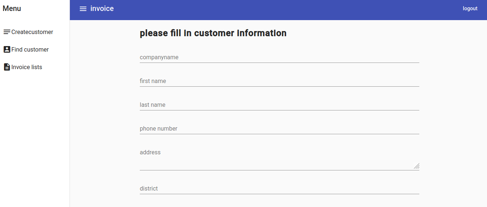
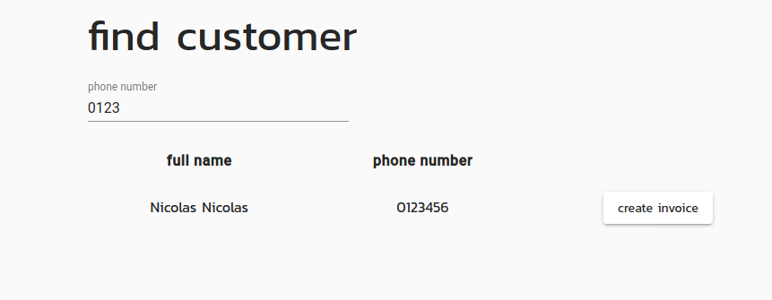
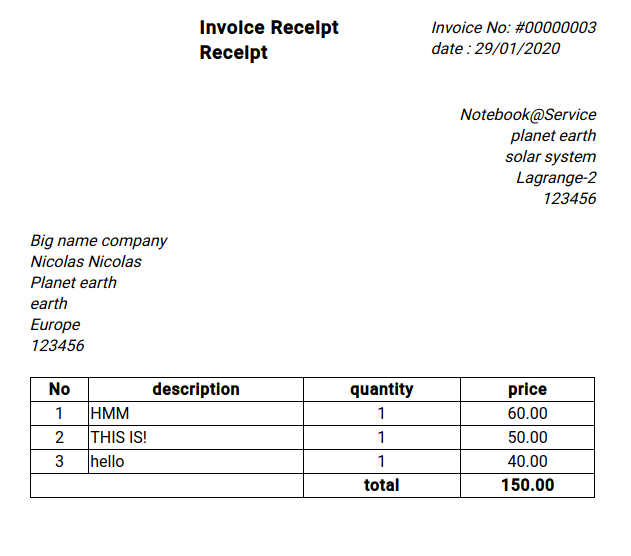

## A simple invoiceapp  

A simeple webapp that generte an invoice reciept and can be print via web-browser.  
custumer information and invoice detail are stored into database.  
this webapp use Angular2+ and Back-end technology with Asp.net core 3.1.  

**create customer page**  

after filled out customer information  
we proceed to search customer_info via phonenumber  

**Invoice detail  page**  

